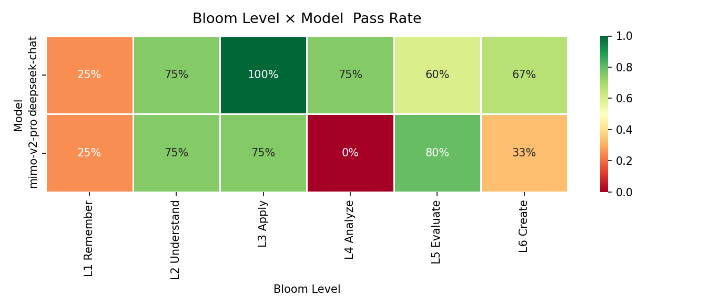

# Agent 定时任务能力评测 — Bloom × LLM-as-a-Judge

> Bloom 认知分层 + LLM Judge + Function Calling + Skill 注入四层评测，暴露模型"说到做不到"的行为鸿沟。

---

## 动机

2026 年初部署开源 Agent 项目 [nanobot](https://github.com/HKUDS/nanobot)（OpenClaw 简化版），手动测试发现其定时任务几乎全部提前触发——模型能理解"5分钟后提醒我"的意图，却无法正确生成时间参数。这不是个别 bug，而是系统性的能力缺陷。随后通过 [learn-claude-code](https://github.com/shareAI-lab/learn-claude-code) 系统学习 Agent 架构原理，并将这些失效观察系统化为本评测框架。

然而市面上的 Agent 评测（AgentBench、ToolBench、TPS-Bench）聚焦于代码生成、API 编排或 workflow 调度，**没有人系统评测过 Agent 对"自然语言→时间参数→定时动作"这个垂直能力的准确性**。

定时任务看似简单（"5分钟后提醒我喝水"），但认知复杂度跨度极大——从 L1 识别意图到 L6 多约束规划，天然匹配 Bloom's Taxonomy 的六层结构。

本项目的核心问题：**模型在"说自己会做什么"和"真正调用工具去做"之间，差距有多大？**

---

## 方法设计

### 三层评测架构

```
Layer 1  意图理解（Phase 2）    模型输出自然语言 → LLM Judge 打分
Layer 2  结构化输出（Phase 2）  模型输出 JSON → 确定性字段断言
Layer 3  工具调用（Phase 3）    模型发起 tool_calls → FakeScheduler 拦截 → 确定性断言
```

### Bloom 认知分层（24 个自动化用例）

| 层级 | 认知能力 | Agent 能力 | 示例 |
|------|---------|-----------|------|
| L1 Remember | 识别 | 识别意图类型 | "5分钟后提醒我喝水" → create_schedule |
| L2 Understand | 理解 | 解析模糊时间 | "明早" → 07:00-08:00 |
| L3 Apply | 应用 | 输出精确参数 | daily + 09:00 + "打卡" |
| L4 Analyze | 分析 | 拆解复合指令 | "取消8点的，改成9点" → [cancel, create] |
| L5 Evaluate | 评价 | 边界决策 | "昨天3点提醒我" → reject |
| L6 Create | 创造 | 多约束规划 | 工作时间每2h提醒，午休跳过 |

### Judge 可信度验证

在使用 LLM Judge 之前，先验证 Judge 本身的可靠性：

- 15 个人工标注样本（覆盖 L1-L6、pass/fail）
- **Cohen's κ = 0.73**（"较好"一致性，Landis & Koch 标准）
- **Spearman ρ = 0.63**（排名相关性显著）
- 重测标准差 σ < 0.1（3 次重复运行）

---

## 核心发现

### 1. Phase 2 意图理解：Bloom × Model 热力图



| Bloom Level | DeepSeek | MiMo v2-pro |
|-------------|----------|-------------|
| L1 Remember | 25% | 25% |
| L2 Understand | 75% | 75% |
| L3 Apply | **100%** | 75% |
| L4 Analyze | 75% | **0%** |
| L5 Evaluate | 60% | **80%** |
| L6 Create | 67% | 33% |
| **Overall** | **67%** | **50%** |

**发现：** MiMo 在 L4 Analyze（复合指令拆解）完全崩溃，但 L5 Evaluate（边界判断）反超 DeepSeek。说明模型弱点不是整体的，而是**认知维度特异性的**——这正是 Bloom 分层的价值。

### 2. Phase 3 工具调用：说到做不到

| 评测方式 | DeepSeek | MiMo v2-pro |
|---------|----------|-------------|
| Phase 2 — 说意图（LLM Judge） | 67% | 50% |
| Phase 3 — 真调用（tool_calls） | **19%** | **25%** |

**这是本项目最重要的发现。**

两个模型在 Phase 2 中都能用自然语言正确描述意图，但在 Phase 3 给了真实工具后，通过率断崖式下降。失败模式高度一致：**有工具可用时反而过度追问**。

典型案例："明天早上8点提醒我开会"——Phase 2 中模型正确回答"会调用 create_schedule"；Phase 3 中模型反而追问"具体是什么会议？"。

**结论：纯文本意图评测会严重高估模型的实际执行能力。**

> **Prompt 设计说明**：Phase 2 使用了 7 条评分规则的详细 system prompt，Phase 3 仅给出一句话角色指令 + tools schema。这是有意为之——真实 Agent 场景中，工具定义本身就是隐式指令，不会再配一套冗长的 prompt；如果对齐 prompt 详细度反而会掩盖模型在工具调用场景下的真实短板。

### 3. 失败模式分类

| 失败模式 | 出现频率 | 影响层级 |
|---------|---------|---------|
| 过度追问（信息已充分仍要求补充） | 最高 | L1-L4 |
| 参数本地化（days 用中文"周一"而非 "monday"） | MiMo 独有 | L3 |
| 多步状态丢失（连续修改只记住第一个） | 两模型共有 | L4 |
| 绝对时间转换失败（无法处理"明天8点"） | 两模型共有 | L2 |

### 4. Phase 5 Skill 注入：写法质量决定一切

通过 5 组对照实验，验证 Skill（SOP 文档）注入对 Function Calling 通过率的影响：

| 组 | 描述 | DeepSeek | MiMo |
|---|---|---|---|
| A | 无 Skill（基线） | 12.5% | 31% |
| B | 正确 Skill v1（API 文档） | 25% | — |
| B | 正确 Skill v3（+few-shot+时间默认值） | **75%** | **75%** |
| C | 错误 Skill（email_skill） | 12.5% | — |
| D | 多 Skill（3 个同时注入） | 25% | — |
| E | 矛盾 Skill（conflict_skill） | **6%** | **88%** |

**发现：**

- **Skill 写法质量的影响（+62.5%）远大于有无 Skill 的影响（+12.5%）**——给模型"模式"比给模型"规则清单"更有效
- 错误 Skill 不产生干扰（模型能识别并忽略），但矛盾 Skill 主动破坏性能
- **冲突容忍度是模型特异的**：同一组矛盾 Skill 让 DeepSeek 崩溃（75%→6%），MiMo 反而不受影响（31%→88%）
- 基于此开发了 `skill_conflict_checker.py`：对 Skill 文件两两比对，自动输出冲突类型、严重程度与修复建议

---

## 项目结构

```
agent_schedule_eval/
├── test_bloom_eval.py          # Phase 2: 意图理解评测（GEval + JSONL）
├── test_tool_calling.py        # Phase 3: Function Calling 评测（确定性断言）
├── test_skill_loading.py       # Phase 5: Skill 注入 5 组对照实验
├── judge_reliability.py        # Phase 1: Judge 可信度验证（κ + ρ）
├── baseline_compare.py         # 多模型对比 + 热力图生成
├── skill_conflict_checker.py   # 静态 Skill 冲突检测工具
├── mock_tools.py               # FakeScheduler — 拦截工具调用供断言
├── conftest.py                 # pytest 路径配置
├── schedule_cases_bloom.yaml   # 24 个 Bloom 分层测试用例
├── human_annotations.yaml      # 15 个人工标注金标准
├── skills/                     # Skill 文件（正确/错误/矛盾）
│   ├── schedule_skill.md       # v3: few-shot + 时间默认值
│   ├── email_skill.md          # 无关 Skill（C 组基线）
│   ├── note_skill.md           # 笔记 SOP
│   └── conflict_skill.md       # 与 schedule_skill 矛盾（E 组）
├── results/                    # 评测输出数据
│   ├── bloom_heatmap.png       # Bloom × Model 通过率热力图
│   ├── results.jsonl           # DeepSeek Phase 2 (72 条)
│   ├── results_mimo_v2_pro.jsonl    # MiMo Phase 2 (72 条)
│   ├── results_tool_calling.jsonl   # DeepSeek Phase 3 (16 条)
│   ├── results_tool_calling_mimo.jsonl  # MiMo Phase 3 (16 条)
│   ├── results_skill_loading.jsonl      # DeepSeek Phase 5 (80 条)
│   └── results_skill_loading_mimo.jsonl # MiMo Phase 5 (48 条)
├── PROGRESS.md                 # 完整学习路径记录
├── RESEARCH.md                 # 学术调研（6 篇论文定位）
├── CONCEPTS.md                 # 评测方法论概念笔记
└── ROADMAP.md                  # 项目路线图
```

---

## 快速复现

```bash
# 1. 安装依赖
pip install -r requirements.txt

# 2. 配置 .env（放在 examples/starter_judge/.env）
DEEPSEEK_API_KEY=sk-xxx
DEEPSEEK_BASE_URL=https://api.deepseek.com/v1

# 3. Phase 1 — Judge 可信度验证
python agent_schedule_eval/judge_reliability.py

# 4. Phase 2 — 意图理解评测（DeepSeek）
python -m pytest agent_schedule_eval/test_bloom_eval.py -v

# 5. Phase 2 — 切换目标模型（MiMo）
$env:TARGET_ENV_PREFIX='MiMo'
$env:TARGET_MODEL='mimo-v2-pro'
$env:RESULTS_FILE='agent_schedule_eval/results_mimo_v2_pro.jsonl'
python -m pytest agent_schedule_eval/test_bloom_eval.py -v

# 6. Phase 3 — 工具调用评测
python -m pytest agent_schedule_eval/test_tool_calling.py -v

# 7. Phase 5 — Skill 注入对照实验
python -m pytest agent_schedule_eval/test_skill_loading.py -v

# 8. 生成对比热力图
python agent_schedule_eval/baseline_compare.py

# 9. Skill 冲突检测
python agent_schedule_eval/skill_conflict_checker.py skills/schedule_skill.md skills/conflict_skill.md
```

---

## 局限性

1. **样本量小**：每个 Bloom 层级仅 4-5 题，统计波动大（L1 的 25% 可能因 1 题翻转变成 50%）
2. **单轮测试**：Phase 3 仅发一条消息，未测试多轮交互中的状态管理
3. **Judge 局限**：κ=0.73 属于"较好"但非"很好"，L5/L6 的模糊场景 Judge 仍有偏差
4. **模型覆盖**：仅测了 2 个模型，无法得出通用结论
5. **Bloom 适配性**：L5 Evaluate 和 L6 Create 的边界在 Agent 场景中不如学术定义清晰

---

## 相关工作

- **Bloom × LLM 评测**：COLING 2025 (Huber & Niklaus) 验证 Bloom 适用于 LLM benchmark 分类，但仅用于通用任务，未涉及 Agent 工具使用
- **Agent 工具使用评测**：TPS-Bench、AgentBench 关注 workflow 编排，不涉及时间解析
- **本项目的差异化**：Bloom × Agent 定时任务 × Skill 冲突检测，目前无同类工作

详见 [RESEARCH.md](RESEARCH.md)。

---

## 作者背景

6 年质量工程经验（芯片图像质量评估 → 空间交互算法评估 → 端侧 AI 模型评估 → LLM/Agent 评测），长期使用 AI 辅助开发，对模型的收益边界和失效模式有持续的一手观察。Bloom's Taxonomy 来自师范教育学训练，不是硬套的理论装饰。
